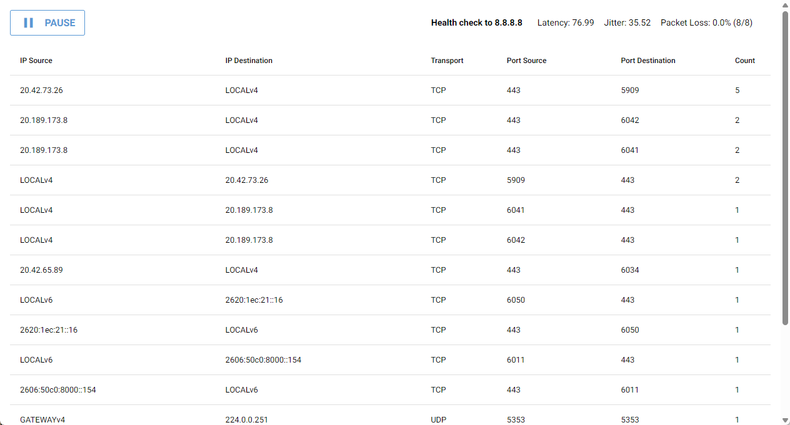

# Packet Sniffer and ICMP Health Checker
This project implements a packet sniffing tool and an ICMP health checker that runs on separate threads. It also use niceGUI to control the sniffing process and display results.
Require npcap (https://npcap.com/) to run.

## Features
- **Packet Sniffing**: Capture and analyze network packets in real-time.
- **ICMP Health Checker**: Monitor latency, jitter, and packet loss by pinging Google Public DNS (8.8.8.8).
- **Interactive GUI**: User-friendly interface for viewing network statistics and sniffing control.

